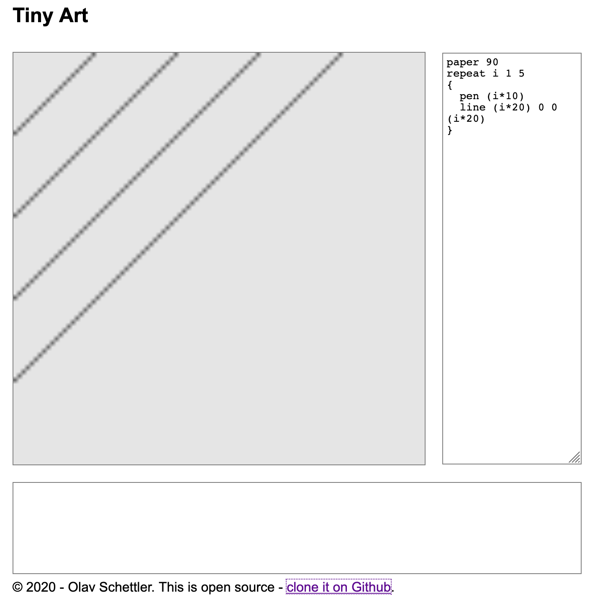

# Tiny Art



An online programming system inspired by the [DBN project](https://dbn.media.mit.edu/) by the Aesthetics and Computation Group at the MIT Media Laboratory. 

Important facts about syntax and semantics of the original language came from the page [DBN Vocabulary](https://dbn.media.mit.edu/info/vocabulary.html) by Zach Lieberman and Rusty Soo-Tho.

## Usage

Run

````
npm install
npm run build
npm start
````

Them, open index.html in a browser and enter a DBN program into the text area.

## Status

This is not yet complete, work in progress. Pull requests are very wellcome.